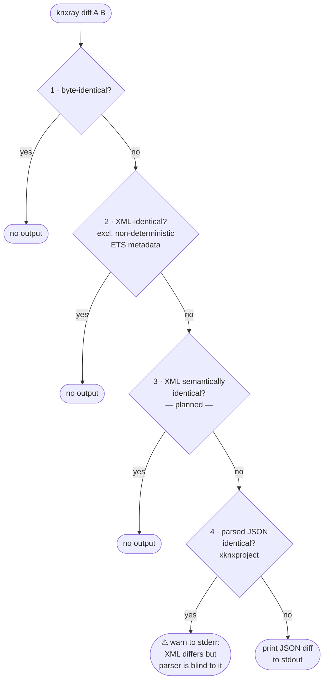

# knxray 

[KNX](https://www.knx.org) is a building-automation standard used to wire up lighting, heating, blinds, and similar systems.
Installations are configured in [ETS](https://www.knx.org/knx-en/for-professionals/software/ets-6/), a proprietary Windows application that stores its project state in `*.knxproj` files — zipped XML archives.

Without knxray, committing a `*.knxproj` to git means `git diff` tells you nothing:

```console
$ git diff HEAD~1 -- my-installation.knxproj
diff --git a/my-installation.knxproj b/my-installation.knxproj
Binary files a/my-installation.knxproj and b/my-installation.knxproj differ
```

knxray makes those files *somewhat* more transparent:
it uses [xknxproject](https://github.com/XKNX/xknxproject) to convert the parts of a `*.knxproj` that can be extracted (group addresses, devices, communication objects) into sorted, stable JSON, which git can then diff normally.

> [!IMPORTANT]
> `xknxproject` only parses a *subset* of your `*.knxproj`, including group addresses, devices, and communication objects.
> Device parameters (for example, a dim curve) live in opaque per-device XML and are **not** shown.
> A clean diff here does **not** mean the `.knxproj` files are identical.
> To highlight these "false negatives", `knxray diff` emits a warning when the `*.knxproj` files differ but the parsed JSON does not.

## How diffing works

A `.knxproj` file is a zip archive containing XML.
Comparing two of them is not as simple as a byte-for-byte check — ETS rewrites internal metadata files (`.validation`, `.certificate`) on every save, even when the project hasn't changed.
knxray therefore applies a cascade of checks, stopping as soon as the two files are considered equivalent at that level:



| Level | What it catches | What it misses |
| --- | --- | --- |
| 1 · byte | anything | — |
| 2 · XML-byte | real project changes | XML whitespace / attribute-order noise |
| 3 · XML semantic *(planned)* | all XML-level changes | — |
| 4 · JSON (xknxproject) | group addresses, devices, comm. objects | device parameters, some ETS settings |

## Commands

### `show`

```sh
knxray show <file.knxproj>
```

Parse `<file.knxproj>` and emit sorted, stable JSON to stdout.
Primary git `textconv` driver — wire it up once with `knxray setup`.

### `diff`

```sh
knxray diff <file1.knxproj> <file2.knxproj>
```

Run the diff cascade on two `.knxproj` files.
Writes a unified JSON diff to stdout; writes a warning to stderr when the files differ in ways the JSON parser cannot see.

### `setup`

```sh
knxray setup [--global]
```

Configure the `textconv` driver for `*.knxproj` files.
Without `--global`, writes to `.git/config` and appends `*.knxproj diff=knxray` to `.gitattributes` in the current repo.
With `--global`, writes to `~/.gitconfig` only.

## Quick start

**One-off inspection** (no install needed):

```bash
nix run github:dataheld/knxray -- show my-installation.knxproj
```

**Permanent git integration:**

```bash
# 1. Install
nix profile install github:dataheld/knxray

# 2. Configure git (once per repo, or --global for all repos)
knxray setup
```

After `knxray setup`, `git diff`, `git show`, and `git log -p` show human-readable JSON diffs on committed `*.knxproj` files automatically.
Under the hood this uses git's [`textconv` driver](https://git-scm.com/docs/gitattributes#_performing_text_diffs_of_binary_files).

> [!NOTE]
> GitHub and GitLab web UIs do not use `textconv`, so `git diff` integration only works locally.

## Related work

- **[AutoBackup](https://it-gmbh.de/en/knx/ets-apps/autobackup/) by IT GmbH** (paid, ETS5/6) — automatically exports a `.knxproj` file to a configurable folder whenever you close a project.
  Pairs naturally with knxray: AutoBackup handles the export step, knxray handles the diff.
  ETS 6.4+ also ships a built-in [Auto Backup to Archive](https://support.knx.org/hc/en-us/articles/31061986226450-ETS-v6-4-0) feature at no extra cost, though it stores versions inside ETS's own archive rather than writing a standalone file to a configurable path.
- **[Project Tracing](https://my.knx.org/shop/product?product_type_category=etsapps&product_type=project-tracing)** by KNX Association (paid, ETS5/6) — logs every user action inside a project (downloads, parameter changes) with timestamps and user identity.
  Think audit trail, not diff view.
- **[Project Comparison](https://it-gmbh.de/en/knx/ets-apps/project-comparison/) by IT GmbH** (paid, ETS5 only) — compares two project snapshots and lists all differences, with direct navigation to changed elements.
  The closest ETS-native equivalent to knxray's diff output, but not available for ETS6.
