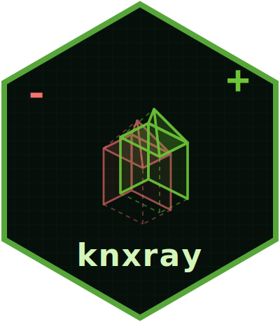

# knxray 

[KNX](https://www.knx.org) is a building-automation standard used to wire up lighting, heating, blinds, and similar systems.
Installations are configured in [ETS](https://www.knx.org/knx-en/for-professionals/software/ets-6/), a proprietary Windows application that stores its project state in `*.knxproj` files — zipped, opaque XML blobs.

This makes version-controlling a KNX installation harder than it should be.
You can commit `*.knxproj` files to git, but `git diff` just says *binary files differ*.
knxray is a helper that makes those files *somewhat* more transparent:
it converts some of the parts of a `*.knxproj` that can be extracted (group addresses, devices, communication objects) into sorted, stable JSON, which git can then diff normally.

> [!IMPORTANT]
> `xknxproject` only parses a *subset* of your `*.knxproj`, including group addresses, devices, and communication objects.
> Device parameters (for example, a dim curve) live in opaque per-device XML and are **not** shown.
> A clean diff here does **not** mean the `.knxproj` files are identical.
> To highlight these "false negatives", `knxray diff` emits a warning when the `*.knxproj` files differ, but the parsed JSON does not.

## How diffing works

A `.knxproj` file is a zip archive containing XML.
Comparing two of them is not as simple as a byte-for-byte check — ETS rewrites internal metadata files (`.validation`, `.certificate`) on every save, even when the project hasn't changed.
knxray therefore applies a cascade of checks, stopping as soon as the two files are considered equivalent at that level:


**Why four levels?**

| Level | What it catches | What it misses |
| --- | --- | --- |
| 1 · byte | anything | — |
| 2 · XML-byte | real project changes | XML whitespace / attribute-order noise |
| 3 · XML semantic *(planned)* | all XML-level changes | — |
| 4 · JSON (xknxproject) | group addresses, devices, comm. objects | device parameters, some ETS settings |

For each of these levels, if a lower level finds no change, all later levels can be skipped.
The warning at step 4 ("XML differs but the parser is blind to it") disappears once level 3 is implemented, because level 3 will have already surfaced those differences.

This is the same approach used for diffing Office documents (`.docx`, `.xlsx`) via git `textconv`:
a semantic parser (e.g. pandoc) extracts the meaningful content; the surrounding zip metadata is silently ignored.

**Currently implemented:** levels 1, 2, and 4.
Level 3 (XML-semantic diff, catching device parameters) is the next planned step.
Once level 3 exists, a `--level` flag will be added to both `show` and `diff` to select the extraction depth explicitly (default: `json`, the current behaviour).
Until then, `knxray show` implicitly uses `--level json`.

## Commands

| Command | Purpose |
| --- | --- |
| `knxray show <file.knxproj>` | Parse → sorted JSON to stdout. Primary git `textconv` driver. |
| `knxray diff <file1.knxproj> <file2.knxproj>` | JSON diff to stdout; warns to stderr when files differ but the diff is empty. |
| `knxray setup [--global]` | Configure git `textconv` for `*.knxproj` files in the current repo (or globally). |

## Quick start

**One-off inspection** (no install needed):

```bash
nix run github:dataheld/knxray -- show my-installation.knxproj
```

**Permanent git integration:**

```bash
# 1. Install
nix profile install github:dataheld/knxray

# 2. Configure git (once per repo, or --global for all repos)
knxray setup
```

After `knxray setup`, `git diff`, `git show`, and `git log -p` show human-readable JSON diffs on committed `*.knxproj` files automatically. Under the hood this uses git's [`textconv` driver](https://git-scm.com/docs/gitattributes#_performing_text_diffs_of_binary_files).

> [!NOTE]
> GitHub and GitLab web UIs do not use `textconv`, so `git diff` integration only works locally.

## Nix flake outputs

```text
packages.default  — virtualenv with knxray on PATH
apps.knxray       — nix run .#knxray
apps.default      — alias for knxray
devShells.default — development shell with editable install + uv
checks.default    — runs pytest in the Nix sandbox
```
